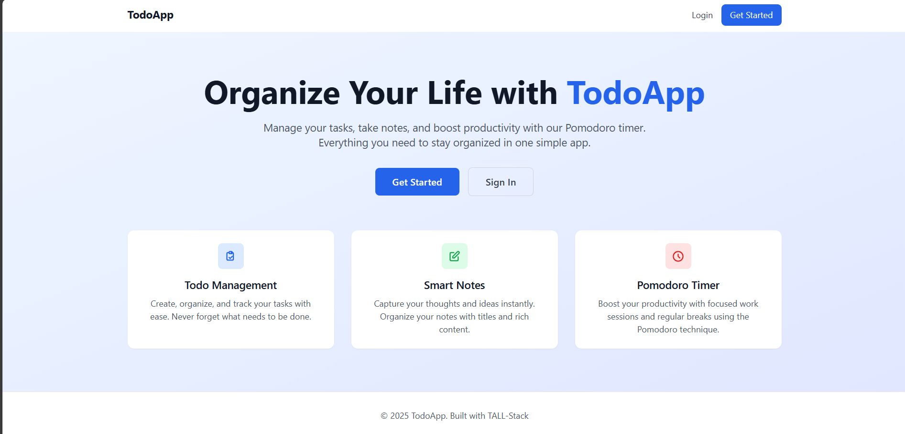
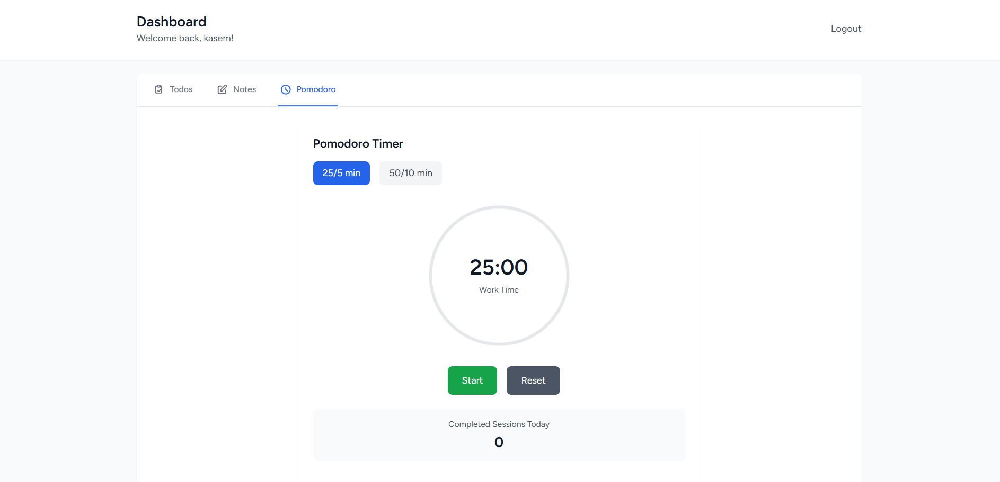
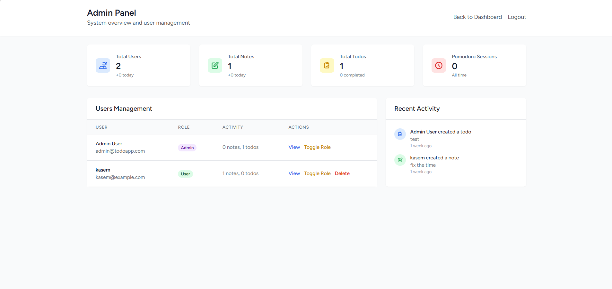
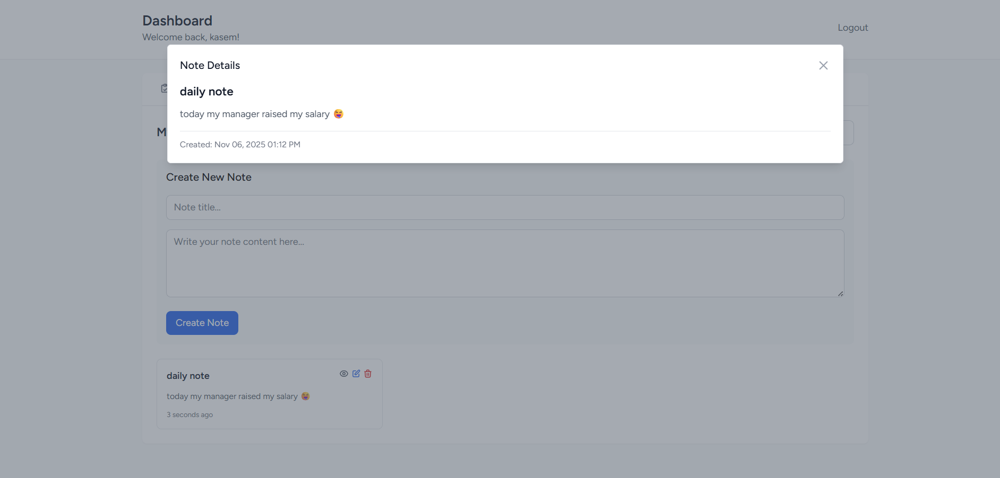

# 📝 Todo App with TALL Stack

A productivity web application built with the TALL stack (Tailwind CSS, Alpine.js, Laravel, Livewire).  
Includes task management, note-taking, and a Pomodoro timer.

## 🚀 Features

- ✅ Add, edit, delete todos
- 🗒️ Create and manage notes
- ⏱️ Pomodoro timer with session tracking
- 👤 User authentication and roles
- 📊 Admin dashboard with Livewire components

## 🧰 Tech Stack

- **Laravel** – Backend & routing
- **Livewire** – Reactive components
- **Alpine.js** – Lightweight JS interactivity
- **Tailwind CSS** – Utility-first styling
- **MySQL** – Database

## 📦 Installation

```bash
git clone https://github.com/Kasemov123/Todo-app-tall-stack.git
cd Todo-app-tall-stack
composer install
npm install && npm run dev
cp .env.example .env
php artisan key:generate
php artisan migrate --seed

## 📸 Screenshots

### 🏠 Home Page  


### ✅ Todos Manager  


### ⏱️ Pomodoro Timer  


### 📊 Admin Dashboard  


### 🗒️ Show Note  



## 📄 License

This project is open-source and available under the [MIT License](LICENSE).

---

## 📬 Contact

**Built by:** [Kasem](https://github.com/Kasemov123)  
Feel free to reach out or contribute!
